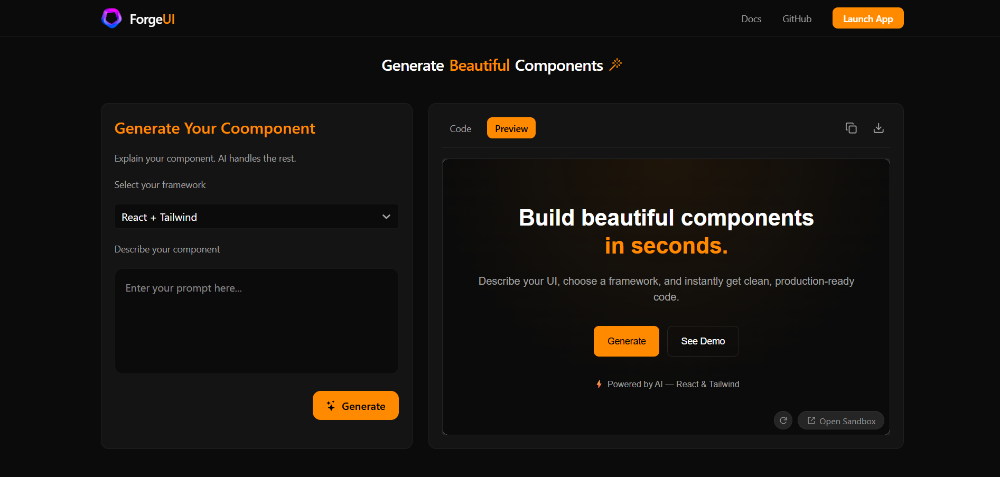

# ForgeUI ⚡

> **Build beautiful UI components in seconds with the power of AI.**

ForgeUI is an intelligent component generator that leverages Google's Gemini 2.5 Flash model to instantly create modern, responsive, and production-ready UI components. whether you need a React component with Tailwind CSS or a plain HTML/CSS/JS snippet, ForgeUI generates it and provides a live, interactive preview.

<!-- SCREENSHOT: -->



> *Add a screenshot of your application here to show users what it looks like!*

## ✨ Features

-   **🤖 AI-Powered Generation**: Utilizes Google's advanced Gemini 2.5 Flash model to understand natural language prompts and generate high-quality code.
-   **⚛️ React + Tailwind Support**: Generates modular React components styled with Tailwind CSS, ready to drop into your projects.
-   **🌐 HTML/CSS/JS Support**: supports generation of standard web components for non-React projects.
-   **👀 Live Interactive Preview**: Integrated **Sandpack** environment allows you to view and interact with the generated code in real-time.
-   **⚡ Vite Powered**: Built on Vite for a blazing fast development experience.
-   **🎨 Modern Design**: The application itself features a sleek, dark-themed UI with glassmorphism effects and smooth animations.

## 🛠️ Tech Stack

-   **Frontend Framework**: [React](https://react.dev/)
-   **Build Tool**: [Vite](https://vitejs.dev/)
-   **Styling**: [Tailwind CSS](https://tailwindcss.com/)
-   **AI Model**: [Google Gemini 2.5 Flash](https://deepmind.google/technologies/gemini/) via `@google/genai`
-   **Code Sandbox**: [Sandpack](https://sandpack.codesandbox.io/)
-   **Icons**: [Lucide React](https://lucide.dev/), [React Icons](https://react-icons.github.io/react-icons/)
-   **Notifications**: [React Toastify](https://fkhadra.github.io/react-toastify/)

## 🚀 Getting Started

Follow these steps to set up ForgeUI locally.

### Prerequisites

-   Node.js (v18 or higher recommended)
-   npm or yarn

### Installation

1.  **Clone the repository**
    ```bash
    git clone https://github.com/your-username/forgeui.git
    cd forgeui
    ```

2.  **Install dependencies**
    ```bash
    npm install
    ```

3.  **Environment Setup**
    Create a `.env` file in the root directory of the project and add your Google Gemini API key:
    ```env
    VITE_API_KEY=your_gemini_api_key_here
    ```
    > 🔑 You can get your API key from [Google AI Studio](https://aistudio.google.com/).

4.  **Run the development server**
    ```bash
    npm run dev
    ```

5.  **Open in Browser**
    Visit `http://localhost:5173` (or the URL shown in your terminal) to use the app.

## 📖 Usage

1.  **Enter a Prompt**: In the input box, describe the UI component you want to create (e.g., "A responsive pricing card with hover effects" or "A modern navigation bar").
2.  **Select Framework**: Choose between "React + Tailwind" or "HTML/CSS/JS".
3.  **Generate**: Click the "Generate" button.
4.  **Preview & Edit**: Watch the component appear in the Sandpack preview pane. You can interact with it and even edit the generated code directly to tweak it.

## 🤝 Contributing

Contributions are welcome! Please feel free to submit a Pull Request.

## 📄 License

This project is open source and available under the [MIT License](LICENSE).
